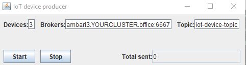
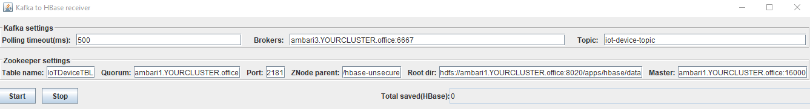

# Kafka and Spark streaming
A Kafka and Spark based application for producing and consuming random generated data with structured-streaming. Finally data get stored into HBase.

The application consists of:
* Kafka producer
* Kafka consumer
* Spark streaming application (consuming from Kafka and storing to HBase)

## Build solution
To build solution navigate under project root directory and execute:
```
sbt compile
```

Then generate JAR file with:
```
sbt compile
```
This will create iot-device-stream-kafka_2.11-0.1.jar under IoT-device-stream-kafka/target/scala-2.11

## Running producer
Navigate under project's root directory and execute:
```
sbt "runMain com.IoT.Producer.IoTProducerWindow"
```
The next window should appear.



## Running Spark streaming consumer
Navigate under project's root directory and execute:
```
sbt "runMain com.IoT.Consumer.KafkaToHBaseWindow"
```
The next window should appear.



Enjoy!